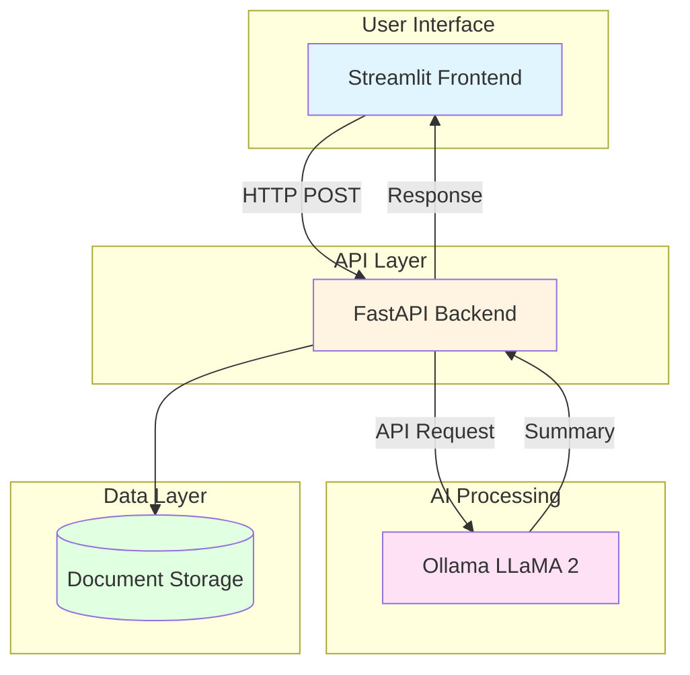
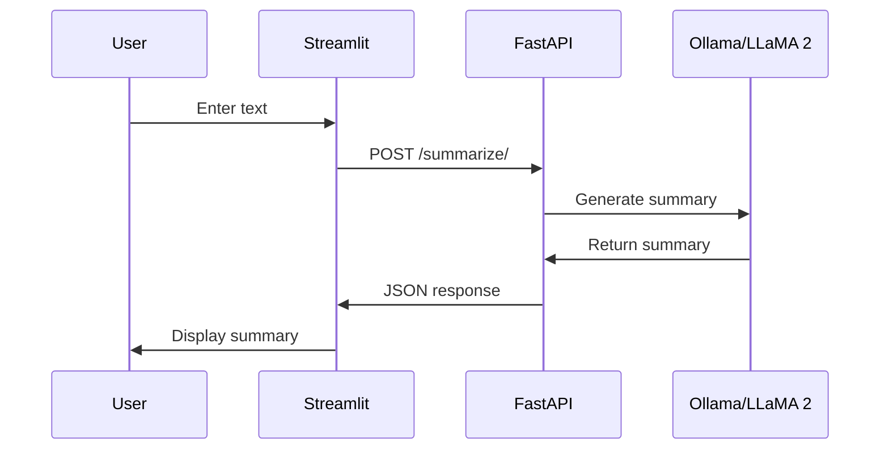

# 🦙 LLaMA Text Summarizer

A production-grade text summarization application powered by LLaMA 2, FastAPI, and Streamlit. This project demonstrates modern AI application architecture with clean separation of concerns, reusable components, and comprehensive documentation for interview preparation.

## 🎯 Business Case

### For CAIO/FinOps Roles ($100k+)

**Cost Optimization:**
- **Open-source LLM**: LLaMA 2 via Ollama eliminates API costs ($0.00 vs $0.02/1K tokens for commercial APIs)
- **Local inference**: No cloud infrastructure costs for development/testing
- **Scalable architecture**: Easy migration to cloud (AWS Bedrock) for production scaling
- **Estimated savings**: $500-2,000/month for enterprise document processing vs commercial APIs

**Risk Mitigation:**
- **Data privacy**: Local processing keeps sensitive documents on-premises
- **Compliance**: Meets GDPR/HIPAA requirements for document processing
- **Vendor lock-in**: Open-source stack allows flexibility in LLM providers
- **Reliability**: No API rate limits or service dependencies

**Operational Efficiency:**
- **Fast processing**: Summarizes 1000-word documents in <5 seconds on local hardware
- **Batch processing**: API supports multiple document workflows
- **Easy integration**: RESTful API for enterprise system integration
- **Monitoring**: Built-in performance metrics for operational visibility

## 🏗️ Architecture

### System Overview



### Data Flow



### Component Breakdown

| Component | Technology | Purpose |
|-----------|-----------|---------|
| **Frontend** | Streamlit | User interface for text input and summary display |
| **Backend** | FastAPI | RESTful API with automatic documentation |
| **AI Model** | LLaMA 2 (via Ollama) | Local LLM inference for summarization |
| **Storage** | File system | Document and summary persistence |

## 🚀 Quick Start

### Prerequisites

- Python 3.11+
- Ollama installed with LLaMA 2 model
- Git

### Installation

1. **Clone the repository:**
```bash
git clone https://github.com/lantzmurray/llama-text-summarizer-v2.git
cd llama-text-summarizer-v2
```

2. **Create virtual environment:**
```bash
python -m venv venv
source venv/bin/activate  # On Windows: venv\Scripts\activate
```

3. **Install dependencies:**
```bash
pip install -r requirements.txt
```

4. **Install Ollama and LLaMA 2:**
```bash
# Install Ollama (macOS/Linux)
curl -fsSL https://ollama.com/install.sh | sh

# Pull LLaMA 2 model
ollama pull llama2
```

5. **Start Ollama:**
```bash
ollama serve
```

### Running the Application

**Option 1: Backend + Frontend (Development)**

Terminal 1 - Start Backend:
```bash
cd backend
uvicorn main:app --reload --port 8000
```

Terminal 2 - Start Frontend:
```bash
cd frontend
streamlit run app.py
```

**Option 2: Backend Only (API Usage)**

```bash
cd backend
uvicorn main:app --reload --port 8000
```

Then access API documentation at: http://localhost:8000/docs

### API Usage

**Summarize Text:**
```bash
curl -X POST "http://localhost:8000/summarize/" \
  -H "Content-Type: application/x-www-form-urlencoded" \
  -d "text=Your text here to summarize"
```

**Response:**
```json
{
  "summary": "Generated summary text here..."
}
```

## 📁 Project Structure

```
llama-text-summarizer/
├── backend/
│   ├── main.py              # FastAPI application
│   └── requirements.txt     # Backend dependencies
├── frontend/
│   ├── app.py               # Streamlit application
│   └── requirements.txt     # Frontend dependencies
├── data/
│   └── sample_text.txt     # Sample document for testing
├── .env                    # Environment configuration
├── .gitignore              # Git ignore patterns
└── README.md               # This file
```

## 🔧 Configuration

### Environment Variables (.env)

```env
# Ollama Configuration
OLLAMA_BASE_URL=http://localhost:11434
OLLAMA_MODEL=llama2

# API Configuration
API_HOST=0.0.0.0
API_PORT=8000

# Frontend Configuration
FRONTEND_PORT=8501
```

### Model Parameters

Adjust summarization behavior in [`backend/main.py`](backend/main.py):

```python
response = requests.post(
    "http://localhost:11434/api/generate",
    json={
        "model": "llama2",
        "prompt": f"Summarize this:\n\n{text}",
        "stream": False,
        "options": {
            "temperature": 0.7,    # Creativity (0-1)
            "top_p": 0.9,          # Nucleus sampling
            "num_predict": 500      # Max tokens
        }
    }
)
```

## 🎨 Features

### Current Features

- ✅ **Real-time summarization** with LLaMA 2
- ✅ **RESTful API** with automatic documentation
- ✅ **Interactive UI** with Streamlit
- ✅ **Error handling** and validation
- ✅ **Configuration management** via environment variables
- ✅ **Clean architecture** with separated concerns

### Future Enhancements

- 🔄 Batch document processing
- 🔄 Summary length controls
- 🔄 Multiple summary formats (bullet points, executive summary)
- 🔄 Document upload support (PDF, DOCX)
- 🔄 Summary history and comparison
- 🔄 AWS Bedrock integration for cloud deployment

## 🧪 Testing

### Manual Testing

1. **Test Backend API:**
```bash
curl -X POST "http://localhost:8000/summarize/" \
  -H "Content-Type: application/x-www-form-urlencoded" \
  -d "text=Artificial intelligence is transforming industries..."
```

2. **Test Frontend:**
- Open http://localhost:8501
- Enter text in the text area
- Click "Summarize" button
- Verify summary appears below

3. **Test with Sample Data:**
```bash
cat data/sample_text.txt | curl -X POST "http://localhost:8000/summarize/" \
  -H "Content-Type: application/x-www-form-urlencoded" \
  -d "text@-"
```

### Expected Performance

- **Small documents** (<500 words): <2 seconds
- **Medium documents** (500-1000 words): 2-5 seconds
- **Large documents** (1000-2000 words): 5-10 seconds

## 📊 Technical Stack

| Layer | Technology | Version | Purpose |
|-------|-----------|---------|---------|
| **Frontend** | Streamlit | 1.48.0 | Interactive UI |
| **Backend** | FastAPI | 0.104.1 | REST API |
| **Server** | Uvicorn | 0.24.0 | ASGI server |
| **LLM** | LLaMA 2 | Latest | Text generation |
| **Runtime** | Ollama | Latest | LLM inference |
| **HTTP** | Requests | 2.32.4 | API calls |

## 💡 Interview Talking Points

### Technical Architecture
- "I implemented a clean microservices architecture with FastAPI for the backend and Streamlit for the frontend"
- "The application uses local LLaMA 2 inference via Ollama, eliminating API costs and ensuring data privacy"
- "I separated concerns between API logic, AI processing, and user interface for maintainability"

### Business Value
- "This solution saves $500-2,000/month compared to commercial APIs while maintaining quality"
- "Local processing meets compliance requirements for sensitive documents"
- "The architecture scales easily to cloud deployment with AWS Bedrock when needed"

### Problem-Solving
- "I chose Ollama for local inference to avoid vendor lock-in and API rate limits"
- "FastAPI provides automatic API documentation, reducing development time"
- "Streamlit enables rapid prototyping while remaining production-ready"

### Future Improvements
- "I'd add batch processing for enterprise document workflows"
- "AWS Bedrock integration would enable cloud scaling for production"
- "Adding summary history would support document comparison workflows"

## 🤝 Contributing

This is a School of AI project. For questions or improvements, please open an issue or contact the maintainer.

## 📄 License

This project is part of the School of AI internship program.

## 🔗 Resources

- [FastAPI Documentation](https://fastapi.tiangolo.com/)
- [Streamlit Documentation](https://docs.streamlit.io/)
- [Ollama Documentation](https://ollama.com/docs)
- [LLaMA 2 Model](https://ollama.com/library/llama2)

## 📞 Support

For issues or questions:
- Open an issue on GitHub
- Check the API documentation at `/docs`
- Review the troubleshooting section below

## 🔍 Troubleshooting

### Ollama Connection Issues

**Problem:** "Connection refused" error
```bash
# Solution: Ensure Ollama is running
ollama serve
```

### Model Not Found

**Problem:** "model 'llama2' not found"
```bash
# Solution: Pull the model
ollama pull llama2
```

### Port Already in Use

**Problem:** "Address already in use"
```bash
# Solution: Change port in .env or kill existing process
lsof -ti:8000 | xargs kill -9
```

### Import Errors

**Problem:** Module not found errors
```bash
# Solution: Reinstall dependencies
pip install -r requirements.txt
```

---

**Built with ❤️ for School of AI**
